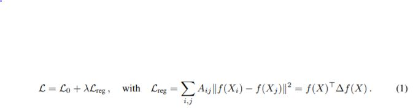
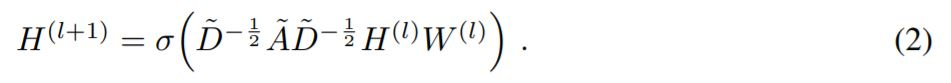
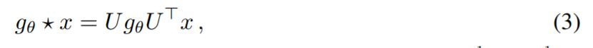
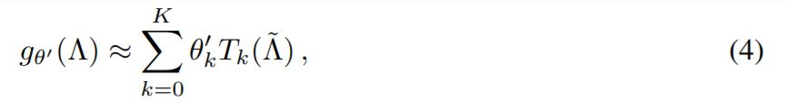
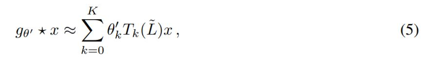
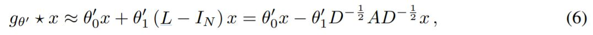
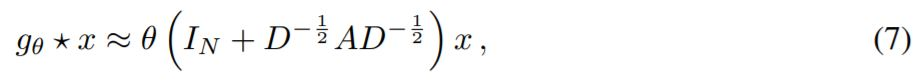
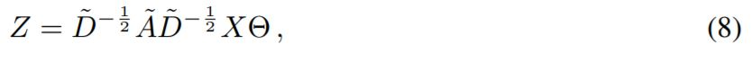
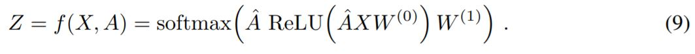
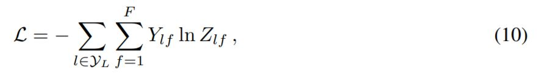

# Semi-Supervised Classification with Graph Convolutional Networks
## previous works

Here, $L_0$ denotes the supervised loss, $\lambda$ is a weighing factor and $X$ is a matrix of node feature vectors, and $\Delta=D-A$ denotes the unnormalized graph Laplacian of an undirected graph $G$, where $A$ is an adjacency matrix and $D$ is a degree matrix.
There was a problem of classifying nodes when using a graph Laplacian regularization term in the loss function(L_reg in equaiton1)
If we use equation1, then we need to assume that adjacent nodes are likely to share the same label. And it restricts modeling capacity, such as every edge should contain similarity between adjacent nodes.
To deal with the problem, this work introduced the neural network model $f(X,A)$ and train on a supervised target $L_0$ for all nodes with labels. Using adjacency matrix allows the model to use information that which connectivity of nodes.
# Motivaiton
## How can we use graphs as an input of Convolutional Network?

Equation2 shows the propagation rule of Graph Convolutional Network(GCN). Here, $\tilde{A}= A+I_N$ is the adjacency matrix with added self-connections, $\tilde{D}$ is a degree matrix with added self-connections, $W^{(l)}$ is a layer-specific trainable weight matrix, $\sigma(\dot)$ denotes an activation function, and $H^{(l)}$ is the matrix of activations in the $l$th layer. 
### Spectral Graph Convolutions
In siganl processing, we use frequency domain to interpret the signal, such as using Fourier transform. Similarly, this work consider spectral convolutions on graphs defined as the multiplication of signal with a filter $g_\theta$ parametrized by $\theta$ in the Fourier domain.

Here, $U$ is the matrix of eigenvectors of the normalized Laplacian. However, evaluating equation3 and computing eigendecomposition of Laplacian is computiationally expensive. Therefore, this work approximated to Chebyshev polynomials as follows.

Then, we have 

The complexity of equation5 is $O(|\epsilon|)$.
We further approximate $\lambda_max=2$ in equation5, then it simplifies to

by taking first two terms of equation5.
In practice, it is more beneficial to constrain the number of parameters to prevent overfitting and to minimize the number of operations per layer. Therefore, we use a single parameter as below.

However, using deep neural network could lead to exploding or vanshing gradients. To alleviate this problem, this work introduce the renormalization trick; adding self-connections to adjacency matrix and a degree matrix. In conclusion, we get the following, where $Z$ is the convolved signal matrix.

If we consider a two-layer GCN, then forward model takes the simple form:

For semi-supervised classification, we evaluate the cross-entropy error over all labeled examples:

# Experiments
